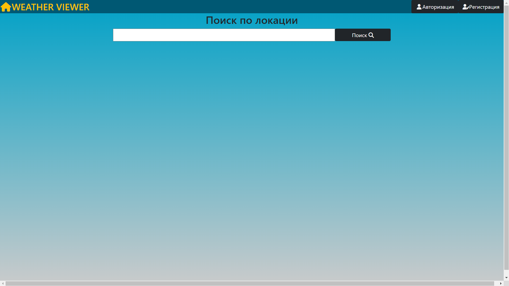
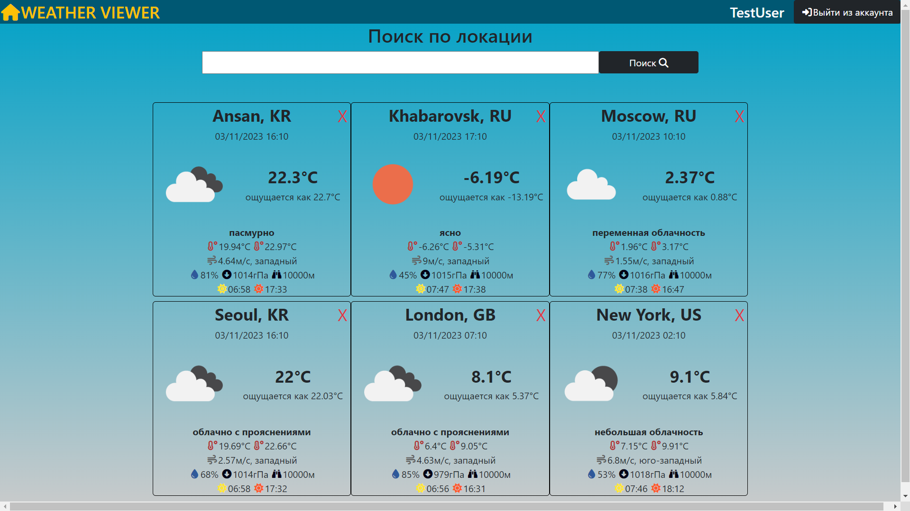
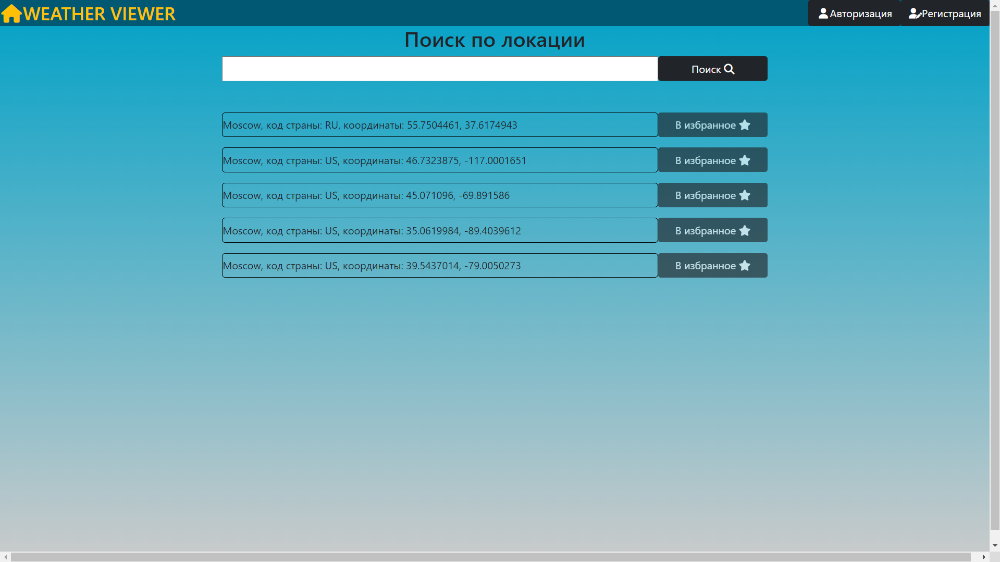
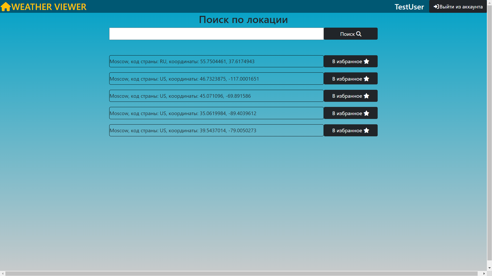
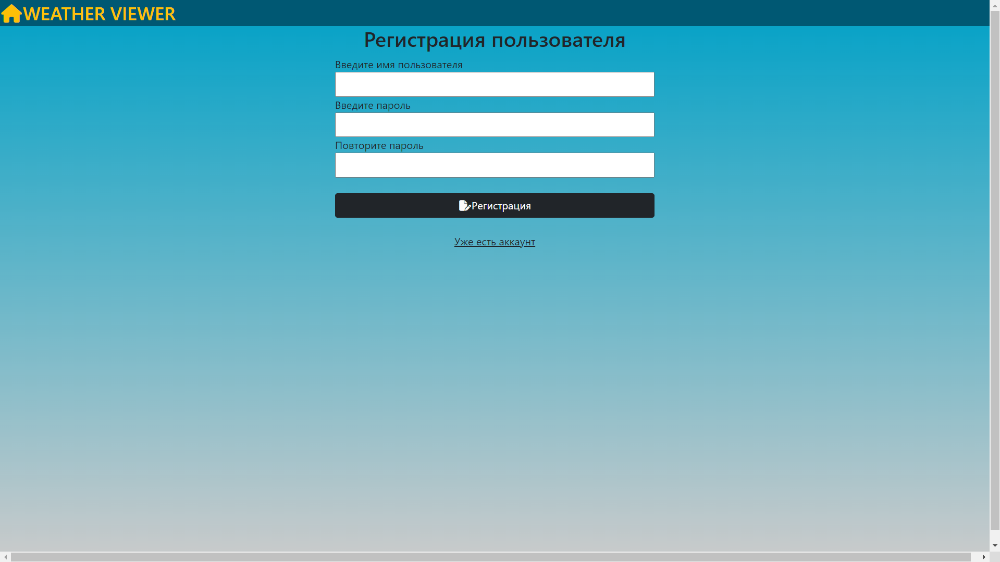
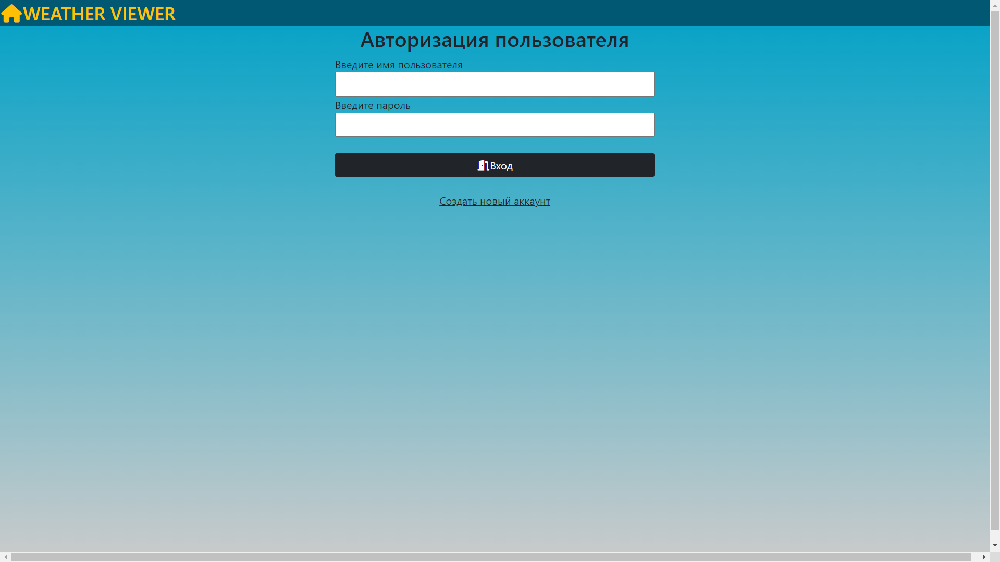

# Проект “Приложение для просмотра погоды”
Описание и ТЗ проекта доступно по адресу:  
https://zhukovsd.github.io/java-backend-learning-course/Projects/WeatherViewer/

Приложение доступно по адресу:  
http://82.146.60.170:9090/WeatherViewer-1.0/

<h2>Используемые технологии</h2>
<ul>
  <li>Java</li>
  <li>Java servlets</li>
  <li>Thymeleaf</li>
  <li>SQL</li>
  <li>PostgreSQL</li>
  <li>H2 (in-memory SQL database)</li>
  <li>Hibernate</li>
  <li>HTML/CSS</li>
  <li>Bootstrap</li>
  <li>JUnit 5</li>
  <li>Mockito</li>
  <li>Паттерн MVC(S)</li>
  <li>Maven</li>
  <li>Apache Tomcat</li>
</ul>

<h2>Мотивация проекта</h2>
<ul>
    <li>Использование cookies и сессий для авторизации пользователей без использования фреймворков</li>
    <li>Работа с внешними API (в данном проекте используется OpenWeatherAPI)</li>
</ul>

<h2>Функционал приложения</h2>
Работа с пользователями:
<ul>
    <li>Регистрация</li>
    <li>Авторизация</li>
    <li>Выход из аккаунта</li>
</ul>

Работа с локациями:
<ul>
    <li>Поиск</li>
    <li>Добавление в список</li> 
    <li>Отображение погоды для добавленных локаций</li>
    <li>Удаление из списка</li>
</ul>

<h2>Интерфейс приложения</h2>
<h3>Главная страница</h3>
Заголовок:
<ul>
    <li>Для неавторизованных пользователей - кнопки регистрации и авторизации</li>
    <li>Для авторизованных пользователей - логин текущего пользователя и кнопка "Выйти из аккаунта"</li>
</ul>

Контент:
<ul>
    <li>Поле ввода для поиска локации по названию</li>
    <li>Список добавленных локаций. Каждый элемент списка отображает название, текущую погоду и кнопку “X” для удаления локаций из списка</li>
</ul>

<h3>Страница результатов поиска локаций по названию - /search</h3>
Переход на эту страницу осуществляется в результате заполнения поля ввода на главной странице, либо на странице результатов поиска.
Содержимое:
<ul>
    <li>Заголовок, такой же как на главной странице</li>
    <li>Поле ввода для поиска по названию - такое же, как на главной странице, чтобы не возвращаться туда для каждого нового поиска</li>
    <li>Список найденных локаций с кнопкой “В избранное”. При нажатии на кнопку происходит переход на главную страницу</li>
</ul>

<h3>Страница регистрации - /registration</h3>
Содержимое:
<ul>
    <li>Заголовок, через который можно вернуться на главную страницу</li>
    <li>Форма с полями для регистрации пользователя</li>
    <li>Ссылка на страницу авторизации, в случае если пользователь уже зарегистрирован</li>
</ul>

<h3>Страница авторизации - /authorization</h3>
Содержимое:
<ul>
    <li>Заголовок, через который можно вернуться на главную страницу</li>
    <li>Форма с полями для авторизации пользователя</li>
    <li>Ссылка на страницу регистрации, в случае если пользователь не зарегистрирован</li>
</ul>

